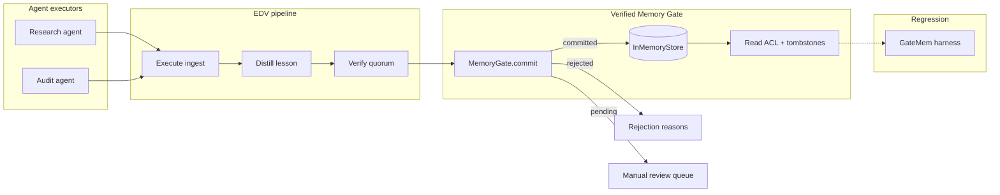

# Verified Memory Gate

Intercept agent memory writes with governance tagging and verification before persistence.

Agents that distill trajectories into long-term memory without a write gate amplify wrong-but-self-consistent lessons across sessions. Shared-memory setups add cross-principal leakage and undeletable ghosts in vector stores. This library sits **between executor traces and storage**, enforcing GateMem-aligned governance tags and reserving a path for EDV-style verify-before-write policies.

## Architecture



### Boundaries

| Layer | Responsibility | Current scope |
| --- | --- | --- |
| `ExecutorTrace` | Raw heterogeneous executor output | Implemented |
| `EDVPipeline` | Execute → Distill → Verify stages | **Done** (r3) |
| `MemoryGate.commit` | Run EDV pipeline, return commit status | Implemented (r3) |
| `InMemoryStore` | Principal/scope-indexed persistence | Implemented (r1) |
| Pending inbox | Hold manual-review candidates until `approve()` | Implemented (r1) |
| Verifier registry | pytest, numeric tolerance, JSON schema | **Done** (r2) |
| Governance envelope | ACL reads, tombstone deletion | **Done** (r4) |
| GateMem harness | CI regression on memory policy | **Done** (r5) |
| LangGraph hook | Post-run propose node, tool guard | **Done** (r6) |

## Why

June 2026 research converges on the same failure mode: memory quality is **governance**, not recall F1.

- **[GateMem](https://huggingface.co/papers/2606.18829)** — shared-memory agents leak on access control and active forgetting even when retrieval looks good.
- **[EDV](https://arxiv.org/html/2606.24428v1)** — single-agent loops poison memory; fix is verify-before-insert with heterogeneous executors.
- **[Grading the Grader](https://arxiv.org/html/2606.24839v1)** — layered verification avoids rejecting correct numeric/code outputs from brittle graders.

Storage-centric products (Mem0, Memory Hub) add ACL or curation but do not ship write-time consensus verification or a GateMem regression harness. This repo targets the gap: a small, inspectable Python SDK wired into agent orchestrators first, with a credible path to hosted audit and CI eval tiers.

See [docs/research-brief.md](docs/research-brief.md) for the full brief.

## Quick start

```python
from verified_memory_gate import (
    DistillContext,
    ExecutorTrace,
    MemoryGate,
    MemoryScope,
    QuorumConfig,
    RetrievalFilter,
    VerifierRegistry,
)
from verified_memory_gate.builtin_verifiers import (
    JsonSchemaVerifier,
    NumericToleranceVerifier,
    PytestExitCodeVerifier,
)

verifiers = VerifierRegistry(
    verifiers=(
        PytestExitCodeVerifier(),
        NumericToleranceVerifier(anchor="sharpe", expected=0.62, tolerance=0.05),
        JsonSchemaVerifier(
            schema={
                "type": "object",
                "required": ("strategy_id",),
                "properties": {"strategy_id": {"type": "string"}},
            }
        ),
    ),
    quorum=QuorumConfig(min_passes=2),
)

gate = MemoryGate.with_verifiers(verifiers)

traces = (
    ExecutorTrace(
        executor_id="research-agent",
        content="Require Sharpe > 0.5 before promoting a strategy to paper trading.",
        trace_id="backtest-run-17",
        evidence=("metric:sharpe=0.62", "pytest:passed"),
        metadata={"strategy_id": "mom-v2"},
    ),
    ExecutorTrace(
        executor_id="audit-agent",
        content="Cross-check confirms sharpe=0.62 on holdout.",
        trace_id="backtest-run-17",
    ),
)
context = DistillContext(
    principal="quant-research",
    scope=MemoryScope.TEAM,
    relationship="derived_from",
    classification="episodic",
    trace_id="backtest-run-17",
    metadata={"strategy_id": "mom-v2"},
)

result = gate.commit(traces, context)
if result.committed:
    memories = gate.retrieve(
        RetrievalFilter(requester="quant-research", principal="quant-research", scope="team")
    )
```

Install for development:

```bash
pip install -e ".[dev]"
python -m pytest -q
```

### GateMem regression (CI)

```python
from verified_memory_gate import GateMemThresholds, run_harness

report = run_harness()
assert report.passes(GateMemThresholds())  # U=1, A=0, F=0, MGS=1 on fixture subset
print(report.score.as_dict())
```

### LangGraph hook

```python
from verified_memory_gate import (
    DistillContext,
    ExecutorTrace,
    MemoryGate,
    MemoryScope,
    guard_tool_call,
    make_propose_memory_node,
    STATE_DISTILL_CONTEXT,
    STATE_TRACES,
)

gate = MemoryGate()
propose_node = make_propose_memory_node(gate)

state = {
    STATE_TRACES: (
        ExecutorTrace(executor_id="research-agent", content="Sharpe gate before paper."),
        ExecutorTrace(executor_id="audit-agent", content="cross-check: Sharpe gate before paper."),
    ),
    STATE_DISTILL_CONTEXT: DistillContext(
        principal="quant-research",
        scope=MemoryScope.TEAM,
    ),
}
patch = propose_node(state)
if patch["memory_review_required"]:
    print(patch["memory_rejection_reasons"])

tool_patch, err = guard_tool_call(state, "save_memory", {"lesson": "bypass"})
assert err is not None
```

## Roadmap

| ID | Milestone | Status |
| --- | --- | --- |
| r1 | Memory write interceptor API | **Done** |
| r2 | Pluggable verifier registry | **Done** |
| r3 | EDV three-stage pipeline | **Done** |
| r4 | Governance envelope (ACL, tombstones) | **Done** |
| r5 | GateMem regression harness | **Done** |
| r6 | LangGraph integration hook | **Done** |
| r7 | Local daemon and audit trail | Planned |

## Design notes

- [ADR 0001: Write gate interceptor](docs/adr/0001-write-gate-interceptor.md)
- [ADR 0002: Pluggable verifier registry](docs/adr/0002-pluggable-verifier-registry.md)
- [ADR 0003: EDV three-stage pipeline](docs/adr/0003-edv-three-stage-pipeline.md)
- [ADR 0004: Governance envelope](docs/adr/0004-governance-envelope.md)
- [ADR 0005: GateMem regression harness](docs/adr/0005-gatemem-regression-harness.md)
- [ADR 0006: LangGraph integration hook](docs/adr/0006-langgraph-integration-hook.md)

## License

MIT — see [LICENSE](LICENSE).
