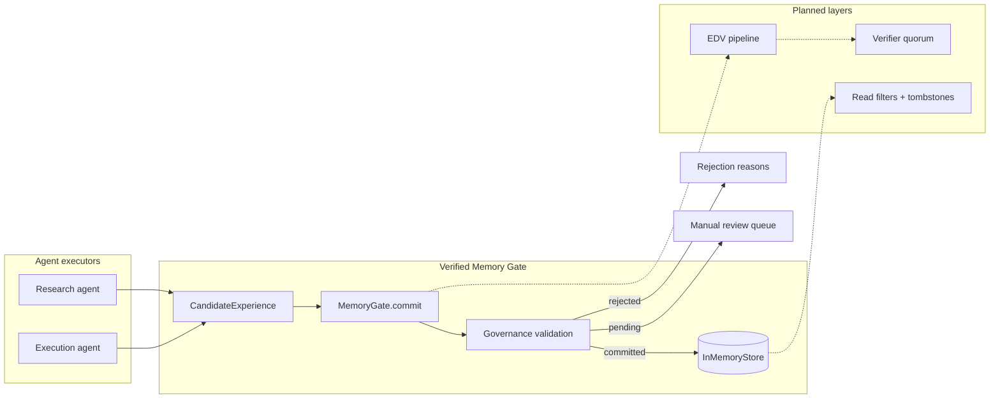

# Verified Memory Gate

Intercept agent memory writes with governance tagging and verification before persistence.

Agents that distill trajectories into long-term memory without a write gate amplify wrong-but-self-consistent lessons across sessions. Shared-memory setups add cross-principal leakage and undeletable ghosts in vector stores. This library sits **between executor traces and storage**, enforcing GateMem-aligned governance tags and reserving a path for EDV-style verify-before-write policies.

## Architecture



### Boundaries

| Layer | Responsibility | Current scope |
| --- | --- | --- |
| `CandidateExperience` | Structured lesson + governance tags | Implemented |
| `MemoryGate` | Validate tags, return commit status | Implemented (r1) |
| `InMemoryStore` | Principal/scope-indexed persistence | Implemented (r1) |
| Verifier registry | pytest, numeric tolerance, JSON schema | Planned (r2) |
| EDV pipeline | Execute → Distill → Verify | Planned (r3) |
| Governance envelope | ACL reads, tombstone deletion | Planned (r4) |
| GateMem harness | CI regression on memory policy | Planned (r5) |

## Why

June 2026 research converges on the same failure mode: memory quality is **governance**, not recall F1.

- **[GateMem](https://huggingface.co/papers/2606.18829)** — shared-memory agents leak on access control and active forgetting even when retrieval looks good.
- **[EDV](https://arxiv.org/html/2606.24428v1)** — single-agent loops poison memory; fix is verify-before-insert with heterogeneous executors.
- **[Grading the Grader](https://arxiv.org/html/2606.24839v1)** — layered verification avoids rejecting correct numeric/code outputs from brittle graders.

Storage-centric products (Mem0, Memory Hub) add ACL or curation but do not ship write-time consensus verification or a GateMem regression harness. This repo targets the gap: a small, inspectable Python SDK wired into agent orchestrators first, with a credible path to hosted audit and CI eval tiers.

See [docs/research-brief.md](docs/research-brief.md) for the full brief.

## Quick start

```python
from verified_memory_gate import (
    CandidateExperience,
    MemoryGate,
    MemoryScope,
    RetrievalFilter,
)

gate = MemoryGate()

candidate = CandidateExperience(
    lesson="Require Sharpe > 0.5 before promoting a strategy to paper trading.",
    principal="quant-research",
    scope=MemoryScope.TEAM,
    relationship="derived_from",
    classification="episodic",
    trace_id="backtest-run-17",
    evidence=("metric:sharpe=0.62", "pytest:passed"),
)

result = gate.commit(candidate)
if result.committed:
    memories = gate.retrieve(RetrievalFilter(principal="quant-research", scope="team"))
```

Install for development:

```bash
pip install -e ".[dev]"
python -m pytest -q
```

## Roadmap

| ID | Milestone | Status |
| --- | --- | --- |
| r1 | Memory write interceptor API | **Done** |
| r2 | Pluggable verifier registry | Planned |
| r3 | EDV three-stage pipeline | Planned |
| r4 | Governance envelope (ACL, tombstones) | Planned |
| r5 | GateMem regression harness | Planned |
| r6 | LangGraph integration hook | Planned |
| r7 | Local daemon and audit trail | Planned |

## Design notes

- [ADR 0001: Write gate interceptor](docs/adr/0001-write-gate-interceptor.md)

## License

MIT — see [LICENSE](LICENSE).
